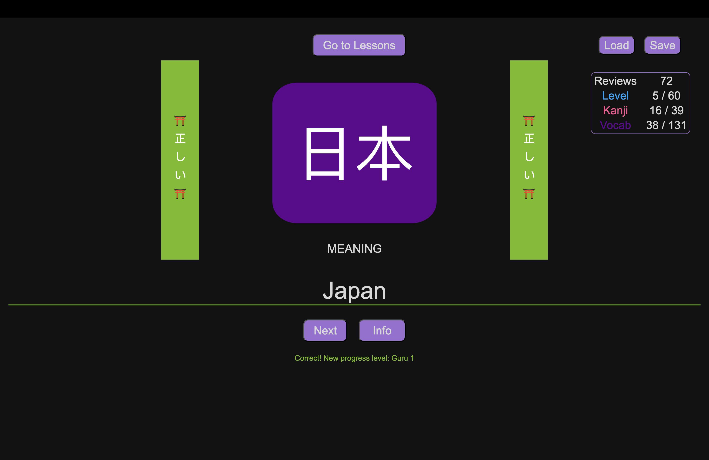
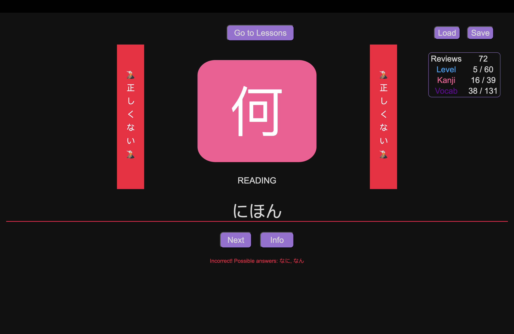
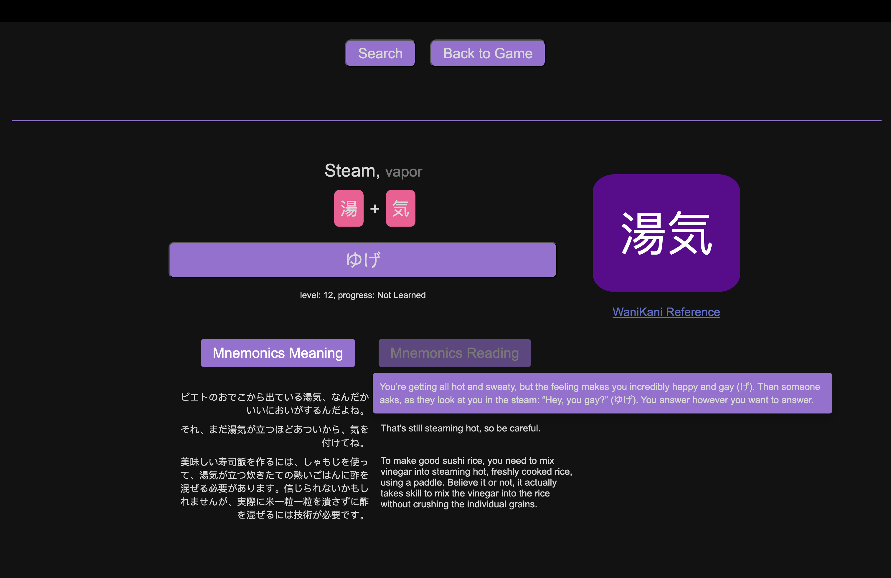
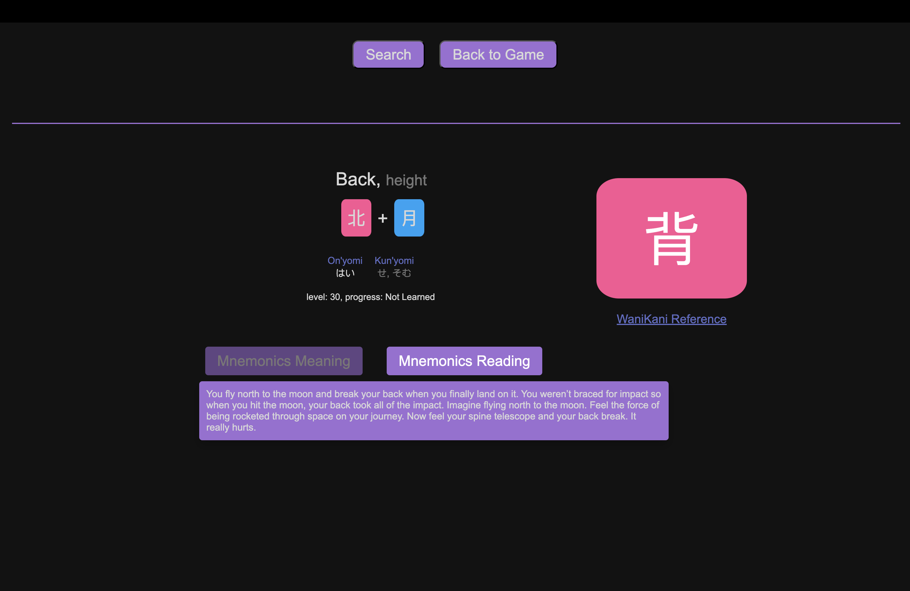
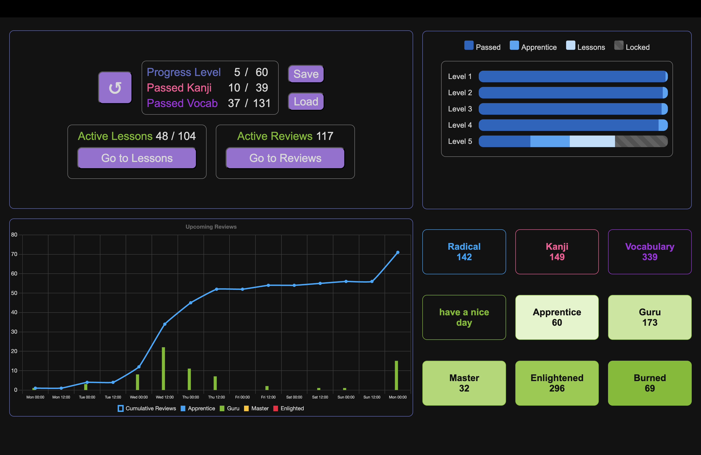

#  [JaniPani](https://philurame.github.io/JaniPani/)

**`おはよう!`**  
> Welcome to **JaniPani**, the **free full version** of [WaniKani](https://www.wanikani.com/) (2023 edition, with minor updates in early 2025).

---

### ⚡ Getting Started
> If you're already familiar with WaniKani, jump straight to [Colab](https://colab.research.google.com/drive/1_es3pIZ07TPzDqUxibZ9bkHt75Ny-g0K?usp=sharing) (or use [CustomProgress.ipynb](extras/CustomProgress.ipynb)) to load your progress!

> If you're new to WaniKani, it's recommended to complete the first three free levels before diving into this game.

---

### ✨ Features
> Custom Mnemonics – If WaniKani’s mnemonics feel odd, create your own! Just press `Enter` when you're done.

> Quick Search – Use `{lvl}{r/k/v}` (e.g., `13v`) to list all radicals (r), kanji (k), or vocabulary (v) for a specific level.

> Stage Overwrite (in search section) – Adjust a character’s progress with `{lvl}{r/k/v}{Symbol} {newStage} {newStage}`. Example: `1v大人 5 6` sets 大人 to Guru 1 for meaning and Guru 2 for reading.

### 🎏 Visuals

> #### Review Feedback
> 
> 

>#### Mnemonics
>
>

> #### Stats Panel
> 

>#### Search Panel
>
