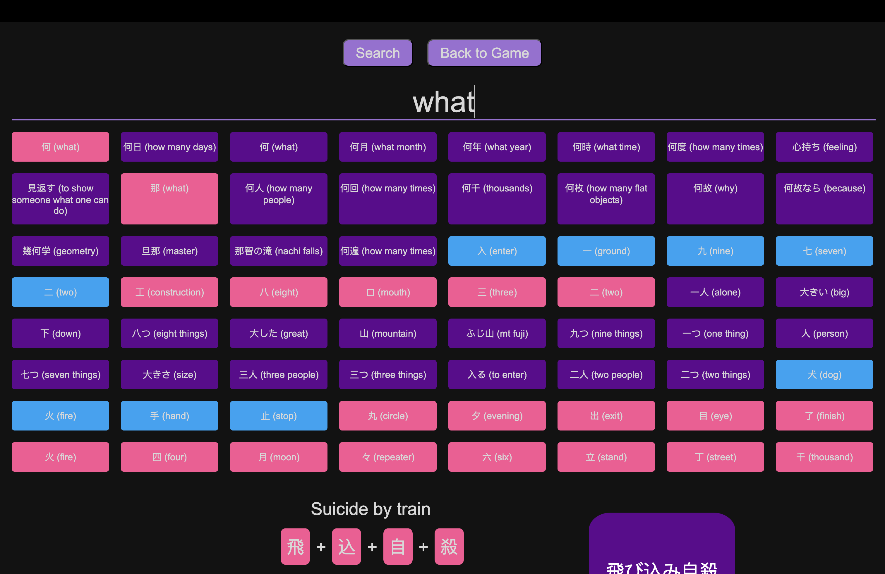

# [JaniPani](https://philurame.github.io/JaniPani/)

**`おはよう!`**  
Welcome to **JaniPani**, the **free full version** of [WaniKani](https://www.wanikani.com/) (2023 edition, with minor updates in early 2025).

---

### Getting Started
> If you're already familiar with [WaniKani](https://www.wanikani.com/) (or [JaniPani](https://github.com/philurame/janipani)), jump straight to [CustomProgress.ipynb](CustomProgress.ipynb) to adjust your progress!

---

### Visuals

#### Review Feedback

#### Mnemonics

#### Search Panel

---